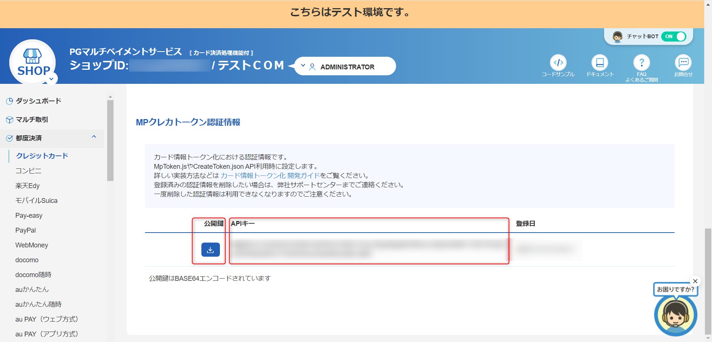

# gmopg-mptoken-js
GMOペイメントゲートウェイが提供する MpToken.js のサンプルプロジェクト

公式の開発ガイド
- https://static.mul-pay.jp/doc/card-token/

## 概要
このプロジェクトは、トークン決済をするためのJavaScriptライブラリ「MpToken.js」のサンプル集です。

MpToken.js はオンライン決済におけるいわゆる「トークン決済」を実現するための JavaScriptライブラリ です。
クレジットカード番号をEC事業者のサーバーに送信せずに、クライアントアプリ上でPSPのサーバーに送信してカード情報をトークン化することで、EC事業者のサーバーにカード情報を通過させることなく、カード決済を行うことができます。

この JavaScriptの提供方法がいくつかあるため、それぞれの方法に対応するサンプルを提供していこうと思います。あくまでサンプルなので、実際の運用には十分なテストを行ってください。

> [!WARNING]
> このサンプルは、一個人によるJavaScriptライブラリのサンプル集です。これを利用することで生じた損害について、当方は一切の責任を負いません。自己責任でご利用ください。

## プロジェクト構成
このプロジェクトは、以下の構成で作成されています。基本的にはpnpmを利用していますが、npmやyarnでも動作します。

```
gmopg-mptoken-js
├── README.md
├── examples
│   ├── README.md
│   ├── pnpm-workspace.yaml
│   ├── mptoken-js
│   │   ├── README.md
│   │   ├── index.html
│   │   └── script.js
│   ├── mptoken-react-js
│   │   ├── README.md
│   │   └── package.json
│   └── mptoken-vue-js
│       ├── README.md
│       └── package.json
└── LICENSE
```

## 環境構築
このプロジェクトを動かすためには、以下の環境が必要です。

- Node.js 20.x 以上
- pnpm 9.x 以上

### プロジェクトのクローン
このプロジェクトをクローンします。

```bash
git clone
```

### 依存関係のインストール

mptoken-react-jsやmptoken-vue-jsのサンプルを動かす場合は、それぞれのディレクトリに移動して依存関係をインストールしてください。
```bash
pnpm i
```

### プロジェクトの起動

このプロジェクトを起動します。カード情報を入力するフォームが表示されます。
```bash
pnpm dev
```

### envファイルの作成
`.env`ファイルを作成して、環境変数を設定します。
GMOペイメントゲートウェイの管理画面から`APIキー`と`公開鍵`を取得して、`.env`ファイルに設定します。

SHOP画面>クレジットカード>設定 に移動して、一番下にスクロールするとAPIキーと公開鍵が表示されます。初めての場合は「登録」をクリックすることで情報が表示されます。



#### mptoken-react-jsの場合

examplesディレクトリに移動して、`.env`ファイルを作成します。
```bash
cp .env.example mptoken-react-js/.env
```

その後、`.env`ファイルにAPIキーと公開鍵を設定します。

#### mptoken-vue-jsの場合

examplesディレクトリに移動して、`.env`ファイルを作成します。
```bash
cp .env.example mptoken-vue-js/.env
```

その後、`.env`ファイルにAPIキーと公開鍵を設定します。


### 初期プロジェクト時のコマンドを残しておく

<details>
<summary>備忘録: プロジェクト作成時のコマンド</summary>

```bash
#### React

[公式のReactサンプル](https://static.mul-pay.jp/doc/card-token/#react-sample)


```bash
# Viteを使ってReactプロジェクトを作成
npm create vite@latest mptoken-react-js -- --template react-ts
# ディレクトリに移動
cd mptoken-react-js
# 依存関係をインストール
pnpm i
# MpToken.jsをインストール
pnpm add @mul-pay/mptoken-js @mul-pay/mptoken-react-js
```

#### Vue

[公式のVueサンプル](https://static.mul-pay.jp/doc/card-token/#vue-sample)

```bash
# Viteを使ってVueプロジェクトを作成
npm create vite@latest mptoken-vue-js -- --template vue-ts
# ディレクトリに移動
cd mptoken-vue-js
# 依存関係をインストール
pnpm i
# MpToken.jsをインストール
pnpm add @mul-pay/mptoken-js @mul-pay/mptoken-vue-js
```

</details>